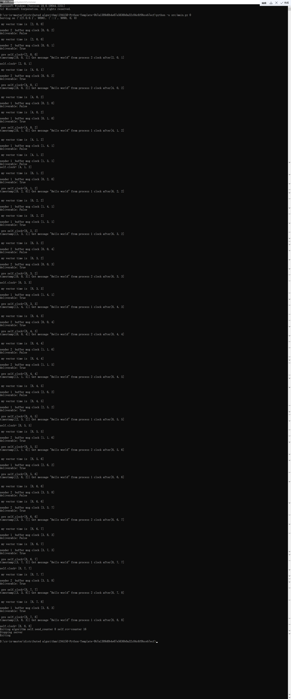
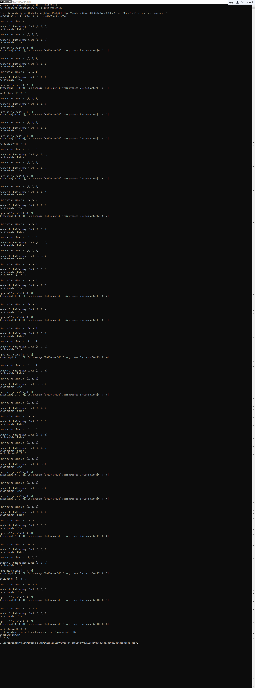
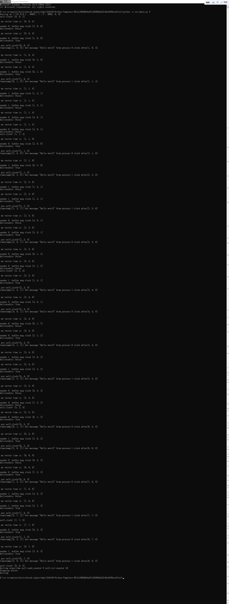

# Implementation
In Birman-Schiper-Stephenson algorithm, each message has a timestamp from its sender. We define a StampMessage class inheriting from the Message class, with a member variable time_stamp. The function algorithm() is called repeatedly and delayed ramdomly. We modify the algorithm() function to perform the Birman-Schiper-Stephenson algorithm. The algorithm() function can be devided into to parts. One is for sending messages and the other is for receiving messges.

## send message
A send_counter is initialized as 0 and incremented each time a process sends a message. When a process Pi sends a message to Pj, it increments Ci[i], where Ci is the vector clock of Pi and i, j represent the process ids. Then it sets the timestamp tm=Ci for message m. Since the Birman-Schiper-Stephenson algorithm is a broadcast algorithm, each process sends the same message to all other processes. In order to emulate such scenarios that a process may receive an earlier sent message after a later sent message arrives, we compose compose two consecutive messages and buffer the first message until the second one has been sent. According to Birman-Schiper-Stephenson algorithm, the receiving process should delay the second message until it receives the first one and accept it.

## receive message
After sending messages, a process checks if its buffer has messages. If true, it will iterate over every message in the buffer and put it back unless:
Cj[i] = tm[i] - 1  &&   for all k <= n and k != i, Cj[k] >= tm[k],
where Pj is the receiving process and Pi the sending process. If a message meets the above criteria, it will be delivered and the receiving process increments Cj[i]. A process also has a deliever_counter to store the number of delievered messages. 

## exit algorithm
We set a num_msg variable to configure how many messages to be sent. When both the send_counter and deliever_counter is not less than num_msg, the algorithm() sets the running flag to False and thus the program is terminated. 


# Test
We performed a system test by setting three processes 0, 1, and 2 to broadcast messages to each other, with each process broadcasting 8 messages. First they print their time and each message also prints the time it carries. False means no, the message is put into the buffer, true means yes, and then the process prints the time before and after the message is received again, and we can see that 1 is added in the corresponding position.






Run algorithm:
```bash
python -u src/main.py 0 &
python -u src/main.py 1 &
# As many commands as there are nodes in your algorithm/implementation
python -u src/main.py n &
```

Expected output is the same as when running with docker-compose.
